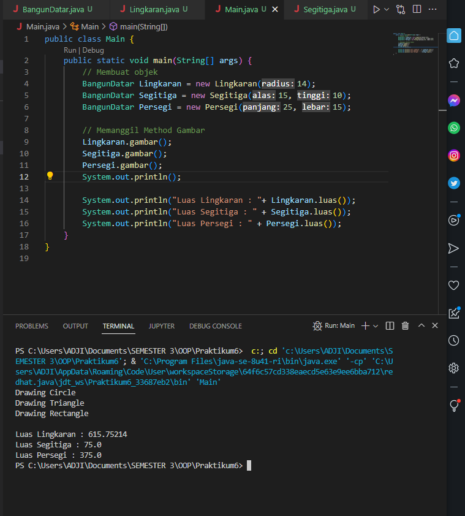

# Praktikum6
Abstract Class  
•Abstrak = tidak memiliki implementasi  
•Class abstract berarti class tersebut terdapat method yg tidak memiliki implementasi  
(kode program), hanya judul method dan parameternya.  
Berikut adalah output dari program hasil override dari class abstract

